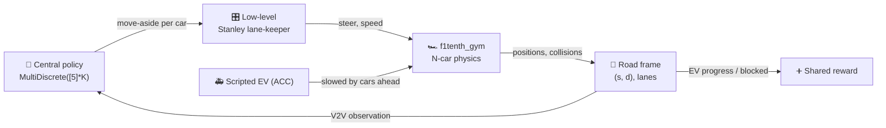
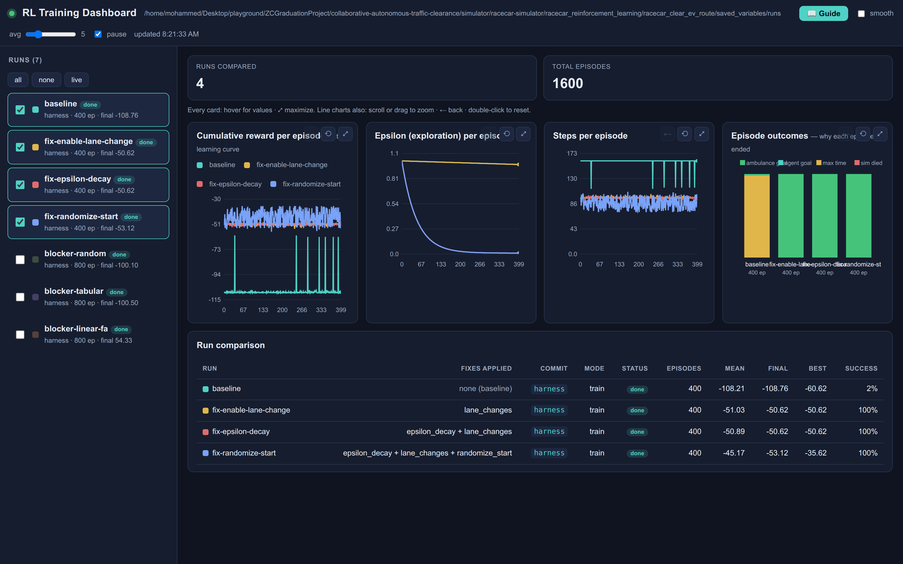

# Collaborative Autonomous Traffic Clearance

> Several small self-driving cars work together to open a path for an emergency vehicle.
> They talk to each other over car-to-car radio, and they learn *when and how* to move aside.

-22314E?logo=ros&logoColor=white)


The idea is simple. An emergency vehicle (EV, think of an ambulance) tells the cars around it where it
is and where it is going. It does this over **V2V**, short for vehicle-to-vehicle communication. Each
ordinary car runs a small learned policy that decides when to move out of the way, so the EV never has
to slow down.

This started as a **2020 graduation project** on ROS Kinetic, Gazebo 7 and Python 2. All three are no
longer supported. We are now rebuilding it on a maintained stack: **ROS 2 Jazzy / Python 3.12**, on top
of the [`f1tenth_gym`](https://github.com/f1tenth/f1tenth_gym) simulator. `f1tenth_gym` simulates
several 1/10-scale race cars at once. We put the "clear the road for the EV" problem on top of it.

We are doing this **gym-first**: get the learning working in the plain simulator, then move it onto
ROS 2.

## Status

| Line | State |
|------|-------|
| **v1.0.0**, ROS 2 / Python 3 (this `master`) | **In progress.** Done: **M0** (the simulator runs), **M1** (the `ClearanceEnv` scenario, baselines and a headroom check), **M2** (one central learned controller matches the hand-written ideal), **M3** (each car decides on its own and still matches). Now: **M4** (a ROS 2 Jazzy demo). |
| **v0.x**, ROS 1 Kinetic / Python 2 (legacy) | Frozen at tags `v0.1.0` to `v0.3.0`. Run `git checkout v0.3.0` for the full Gazebo project. Removed from `master` in M1 ([ADR 0003](docs/adr/0003-refactor-in-place-preserve-legacy-with-tags.md)). Its docs are in [`docs/legacy/`](docs/legacy/). |

Every big decision, and why we made it, is written down as a short **Architecture Decision Record**
in [`docs/adr/`](docs/adr/). Ideas for later are in [`ROADMAP.md`](ROADMAP.md).

## Before you start: install Docker

Everything runs in Docker. **Nothing is installed on your machine** except Docker itself. You need
**Docker Engine** and the **Compose plugin**. On Debian or Ubuntu the normal packages are enough:

```bash
sudo apt-get update
sudo apt-get install -y docker.io docker-compose-v2 docker-buildx
sudo systemctl enable --now docker      # start Docker now, and on every boot
sudo usermod -aG docker "$USER"         # so you can run docker without sudo
```

> **Important: the `docker` group only works after you log in again.** After `usermod -aG docker`,
> **reboot, or log out and back in**. Opening a new terminal is not enough. (On Ubuntu 25.10 and
> 26.04 the old `newgrp` / `sg` trick is no longer installed.) Check with
> `docker run --rm hello-world`. Any recent Docker works. We tested on Ubuntu 26.04 with `docker.io` 29.x.

## Quick start (v1.0.0)

```bash
git clone https://github.com/MohammedEl-sayedAhmed/collaborative-autonomous-traffic-clearance.git
cd collaborative-autonomous-traffic-clearance

./run.sh gym-build          # build the Python image (pins f1tenth_gym @ v1.0.0)   (~3–5 min)
./run.sh gym-smoke          # M0: the simulator runs without a screen -> "OK: gym base runs headless."
./run.sh clearance-smoke    # M1: the scenario is worth learning (doing nothing << doing it right)
./run.sh gym-test           # M1: unit tests
```

`./run.sh` with no arguments lists every command.

## M1: the ClearanceEnv scenario

`ClearanceEnv` wraps `f1tenth_gym` (we did **not** fork it). It turns the empty race track into our
problem: one **scripted EV** (`agent_0`) has to get down a road with 3 virtual lanes, and **K cars we
control** start spread out in its lane, in its way.



- **How blocking works: adaptive cruise on wide lanes** (ADR 0007). Our cars drive slowly. The EV
  uses **ACC** (adaptive cruise control, the same idea as in a modern car): it follows whatever is in
  front of it at a safe distance. So a car left in its lane holds it down to a slow convoy speed, with
  no crash. A car that moves aside in time lets it **sprint**. The gap between the two is about
  **4× in speed**, which gives the learner a clear signal to learn from.
- **Cars are spread out along the road**, so the reward goes up with every car that moves aside in
  time. This avoids the trap the 2020 project fell into, where the task was so easy that even random
  actions looked optimal and no algorithm difference could show.
- **A check before any training** (`./run.sh clearance-smoke`) proves that "nobody moves" is much worse
  than "everyone moves in time". It **exits with an error** if that gap is not there. We call this gap
  the **headroom**.

The baseline policies log to the dashboard, so you can see the band a learner has to climb:

```bash
./run.sh clearance-eval --policy naive  --preset easy --episodes 20
./run.sh clearance-eval --policy ideal  --preset easy --episodes 20
./run.sh dashboard      # compare at http://127.0.0.1:8770
```

Full design: [`docs/design/m1-clearance-env.md`](docs/design/m1-clearance-env.md) and
[ADR 0007](docs/adr/0007-m1-clearance-env-design.md).

## M2: training it (PPO)

One central **PPO** learner (from the stable-baselines3 library; PPO is a standard reinforcement
learning algorithm) picks the move-aside action for all K cars at once. The EV stays scripted. Every
training episode streams to the dashboard in the same format the baselines use, and the trained policy
is scored through the *same* code as the baselines, so the tables below compare like with like
([ADR 0008](docs/adr/0008-train-with-stable-baselines3-ppo.md)).

```bash
./run.sh clearance-smoke                        # never train a scenario that has not passed this
./run.sh train-build                            # image: + stable-baselines3, CPU-only torch
./run.sh clearance-train --preset easy --timesteps 300000 --n-envs 8
./run.sh dashboard                              # watch it climb the baseline band, live
```

**Result on EASY** (20 test episodes each; 300k training steps take about 16 min on 8 CPU cores):

| policy | success | collisions | mean `t_clear` | EV mean speed | lane changes | return |
|--------|--------:|-----------:|---------------:|--------------:|-------------:|-------:|
| `naive` (nobody moves) | 0% | 0% | — *(runs out of time)* | 2.29 m/s | 0 | 31.4 |
| `random` | 30% | 45% | 11.67 s | 3.50 m/s | 80.8 | −2.0 |
| `ideal` (hand-written best case) | 100% | 0% | 6.13 s | 7.31 m/s | 3.0 | 102.2 |
| **PPO (learned)** | **100%** | **0%** | **6.00 s** | **7.44 m/s** | **3.0** | **102.3** |

`t_clear` is the time the EV needs to reach its goal. The learned policy **matches the hand-written
ideal**: 100% success, no collisions, a slightly faster clearance, and exactly K=3 lane changes, one per
car. It learned to move aside once, at the right moment, instead of wobbling around like `random` does
(80 lane changes per episode). Compared with nobody moving, the EV goes **3.2× faster** and finishes a
route it otherwise never finishes.

**Result on HARD** (250k training steps). Here each of our cars has one of its two side lanes blocked
by another car. The free side has to be read from the V2V information. Guessing means a crash.

| policy | success | collisions | mean `t_clear` | EV mean speed | return |
|--------|--------:|-----------:|---------------:|--------------:|-------:|
| `naive` | 0% | 0% | — *(runs out of time)* | 2.29 m/s | 31.4 |
| `random` | 25% | **60%** | 11.78 s | 3.65 m/s | −24.4 |
| `ideal` (hand-written best case) | 100% | 0% | 6.13 s | 7.30 m/s | 102.2 |
| **PPO (learned)** | **100%** | **0%** | **6.00 s** | **7.43 m/s** | **102.3** |

`random` crashes in 60% of HARD episodes by merging into a lane that is taken. The learned policy never
does. This is the 2020 project's "blocker" scenario, which its table-based learner could not solve. It
is now solved from the V2V observation alone.

## M3: each car decides on its own

M2 is still one brain for all cars: one network sees all K cars and outputs all K actions. In M3 we
take that away. Each car decides from **its own 26 numbers only** (what it senses itself, plus the V2V
messages it can hear), using one shared network that runs K times. **No car sees the whole picture**
([ADR 0009](docs/adr/0009-decentralized-execution-ippo.md)).

```bash
./run.sh clearance-smoke --m3     # is a car's own view enough? (a hand-written local policy)
./run.sh dec-smoke                # does the plumbing work, and is the view really local?
./run.sh clearance-train-dec --preset strict --timesteps 900000 --n-envs 8
```

M2 already matches the ideal, so M3 does **not** claim to do better. It claims **the same result with
less information**, backed by checks that fail if any car reads shared state. It also adds two things a
single central brain cannot do:

| | M2 central | **M3 each car alone** |
|---|---|---|
| **STRICT** (speeding up cannot help) | 100%, 0 collisions, `t_clear` 6.13 s, **3.0 yields** | **identical, and equal to the ideal** |
| HARD | 100%, 0 collisions, `t_clear` 6.00 s | **identical** (both reach the best possible) |
| EASY (50 shared seeds) | 100%, 0 collisions, `t_clear` **6.00 s** | 100%, 0 collisions, `t_clear` 6.58 s (+9.7%); **6.12 s (+1.9%) with `--central-critic`** |
| same weights with K=4 cars | impossible (built for exactly K) | 100%, `t_clear` 6.48 s |
| half of all V2V messages lost | cannot be expressed | 100%, `t_clear` 6.80 s |

Each car can even run as **its own operating-system process**, getting only its own observation over a
pipe, and produce the same numbers. That is the end-to-end proof that nothing shared is needed.

The EASY row taught us something about the **scenario**, not about M3. Because the EV follows whatever
is in front of it, our cars can let it through by simply *speeding up*, **without anyone moving
aside**. That gets 100% success at about 95% of the ideal's return. So **the success rate alone cannot
tell real cooperation from a fast convoy. Only the clearance time can.** On EASY the M3 policy was
partly taking that shortcut (2.3 yields instead of 3.0).

The **STRICT** preset ([ADR 0010](docs/adr/0010-strict-preset-removes-the-convoying-substitution.md))
closes the shortcut: a car is speed-capped while it is still in the EV's lane, so it cannot outrun the
ambulance in its own lane. There, the same learner yields **3.0 out of 3.0 and matches the ideal
exactly**. EASY and HARD keep their published numbers. A `--policy speedup` baseline and two checks make
sure the shortcut stays visible.

Two separate fixes each close the EASY gap, which is what makes us trust the explanation: remove the
shortcut (STRICT), **or** let the learner's value estimate see the whole scene during training while
each car still acts on its own view (`--central-critic`, which gets to 6.12 s with the shortcut still
open). Full analysis: [`docs/design/m3-decentralized-execution.md`](docs/design/m3-decentralized-execution.md).

## Watching it

Training runs without a screen, but you can replay any policy as a top-down video, or watch it live:

```bash
./run.sh clearance-watch --policy naive                              # the blocked baseline -> mp4
./run.sh clearance-watch --model saved_variables/models/ppo-easy.zip # the trained policy -> mp4
./run.sh clearance-watch --model saved_variables/models/ppo-hard.zip --preset hard
./run.sh view-build                                                  # once: X11 libs for a window
./run.sh clearance-watch --policy ideal --mode human                 # a live window
```

The view draws the road as a straight strip (the lanes are offsets from the road's centre line, so this
is the natural way to look at it). Each of our cars is coloured by whether it has left the EV lane, and
the EV's state is shown as **BLOCKED, held at convoy speed** or **CLEAR, sprinting**.

## M4: running it on ROS 2 (in progress)

So far everything runs inside one Python program. M4 moves the cars onto **ROS 2**, the standard
robotics middleware, so each car becomes its **own program on a real message bus**. That is the same
shape a real 1/10-scale car would use.

The plan in one line: **keep one simulator, add K car programs.**

- One program owns the physics. It is the *same* `ClearanceEnv` that produced every number above, so
  the results stay comparable. Nothing is re-implemented.
- Each of our cars gets its own ROS 2 node. It receives only its own state and its own V2V messages,
  and publishes only its own steering and speed command.
- The simulator swaps in those K commands and nothing else. That is the entire change, one slice of one
  array, which is what keeps the physics honest.

We target **ROS 2 Jazzy** because it is supported until **May 2029**. Humble, the older long-term
release, stops getting updates in **May 2027**, and this whole rewrite exists to get off unsupported
software ([ADR 0012](docs/adr/0012-target-ros2-jazzy-not-humble.md)). Jazzy ships Python 3.12, so the
project's images moved to Python 3.12 too. One Python version everywhere means the physics is identical
in both places.

**Where it stands:** the ROS 2 image is a numerical twin of the plain one (the same recorded runs
replay in it bit for bit), and **all three cars drive over ROS 2 on the learned policy**. Each car is
its own program: it receives its own odometry, hears the other cars only through a relay that models
the radio (range, and optionally loss and delay), decides with the trained network exported to plain
numpy (no torch on the robot), and publishes a steering and speed command every 10 ms. The bridge
waits for every car's command before it moves the physics by one tick, so timing cannot blur the
comparison. A gate node watches the live graph and checks that no car listens to anything but its own
four topics. On all three presets, the ROS run and the plain run **agree on every tick**; the cars that
should fail (never moving, or only speeding up) do fail through the full graph. Try it:

```bash
./run.sh ros-build                          # once: ros:jazzy + our package + our messages
./run.sh ros-fingerprint --gate             # is the ROS image a numerical twin? (expect IDENTICAL)
./run.sh ros-smoke --preset strict --seeds 0,1   # one car over ROS 2, then the checks
./run.sh ros-fleet --preset strict --seeds 0,1   # all three cars, relay, learned policy, gate, rosbag, dashboard
./run.sh ros-gate                           # every ROS check in one go (about 5 minutes)
./run.sh ros-video saved_variables/ros/fleet/strict-seed0-ep0.npz   # a ROS run as a top-down mp4
./run.sh ros-view-build && ./run.sh ros-demo      # watch it: the fleet at real time ...
./run.sh ros-view 42                              # ... and RViz beside it (second terminal)
```

A recorded run can also be **replayed from a rosbag** into a fresh car node with nothing but the
car's own four topics, and it decides and drives exactly as it did live. A car program with any hidden
input could not pass that.

M4 is **not** trying to make the cars drive better. They already match the ideal. It has to prove three
things instead, each with a check that fails loudly if it is not true:

1. the car programs read exactly the same numbers they were trained on;
2. a recorded run replays into the plain simulator and gives the same result;
3. no car program can see anything it should not. We publish the full ground truth on purpose and then
   check that **no car is subscribed to it**.

Full plan: [`docs/design/m4-ros2-mechanical-demo.md`](docs/design/m4-ros2-mechanical-demo.md) and
[ADR 0011](docs/adr/0011-m4-ros2-mechanical-demo.md).

## Training dashboard

A live dashboard with no dependencies, to watch training and compare runs (each tagged with its git
commit). It reads the JSONL files that `clearance-eval` and training write, so it does not care which
simulator is underneath. It carried over from the legacy line unchanged.



*(Shown: the legacy fix-by-fix campaign, success going from 3% to 100%. In v1.0.0 the same dashboard
shows the naive / random / ideal band for `ClearanceEnv`.)*

```bash
./run.sh dashboard-demo && ./run.sh dashboard    # try it now with made-up runs
```

See [docs/DASHBOARD.md](docs/DASHBOARD.md) and [docs/DASHBOARD_GUIDE.md](docs/DASHBOARD_GUIDE.md).

## Legacy (the 2020 ROS 1 / Gazebo project)

The original project is **kept, and still builds, at the tags**: the Gazebo simulation, the V2V
package (`racecar_communication`), a custom `move_base` costmap layer, the `move_car` action stack,
AMCL / gmapping, and the single-car Q-learning move-aside that was the headline result.

```bash
git checkout v0.3.0     # the full ROS 1 / Gazebo project + its run.sh sim|nav|movecar|ev|rl|…
```

Its documentation is in [`docs/legacy/`](docs/legacy/) (architecture, subsystems, packages, how to
run, known issues, RL experiments). It was removed from `master` in M1 per
[ADR 0003](docs/adr/0003-refactor-in-place-preserve-legacy-with-tags.md).

## Thesis

The graduation thesis lives in a separate **private** repository and is linked here as a git
submodule at [`thesis/`](thesis/). If you have access:

```bash
git submodule update --init thesis
./run.sh thesis        # build -> thesis/main.pdf (TeX Live in Docker)
```

## Repository layout

```
collaborative-autonomous-traffic-clearance/
├── run.sh                     # runs everything in Docker; the one entry point (v1.0.0)
├── pyproject.toml             # the caatc package (pins f1tenth_gym @ v1.0.0)
├── caatc/                     # v1.0.0 Python 3 package: the learning code on f1tenth_gym
│   ├── clearance_env.py       #   M1 ClearanceEnv (the EV-clearing scenario) + the M4 seam
│   ├── scenario.py            #   scenario settings, EASY/HARD/STRICT presets, track builder
│   ├── frenet.py              #   road frame: distance along the road (s) and across it (d)
│   ├── controllers.py         #   Stanley lane-keeper + the scripted EV (ACC)
│   ├── baselines.py           #   naive / random / speedup / ideal reference policies
│   ├── clearance_eval.py      #   evaluate a policy and log dashboard runs
│   ├── clearance_smoke.py     #   the headroom check that runs before any training
│   ├── train.py               #   M2 PPO training + live dashboard logging
│   ├── train_dec.py           #   M3 per-car training (shared IPPO, optional central critic)
│   ├── decentralized.py       #   M3 per-car policies + the "local view only" guard
│   ├── obs_spec.py            #   what the 26 per-car observation numbers mean
│   ├── vec_agents.py          #   N joint envs -> N*K single-car streams
│   ├── central_critic.py      #   CTDE: each car acts alone, the critic sees all (training only)
│   ├── pz_env.py              #   PettingZoo adapter (for outside multi-agent libraries)
│   ├── proc_fleet.py          #   one operating-system process per car (the M3 proof)
│   ├── dec_smoke.py           #   the M3 plumbing + locality check
│   ├── play.py                #   replay a policy: mp4 or a live window
│   ├── render2d.py            #   the top-down scene drawing
│   ├── smoke.py               #   M0 smoke test
│   └── tests/                 #   unit tests (+ golden/ traces recorded before the M4 seam)
├── docker/                    # gym (dev) + gym-test + gym-train (SB3) + gym-view (X11)
├── tools/dashboard/           # the training dashboard (reads JSONL runs)
├── docs/adr/                  # Architecture Decision Records (the migration decisions)
├── docs/design/               # design docs (M1, M3, M4)
├── docs/legacy/               # docs for the tagged 2020 ROS 1 / Gazebo stack
└── thesis/                    # graduation thesis (private submodule; ./run.sh thesis)
```

## Documentation

| Doc | What it covers |
|-----|----------------|
| [adr/](docs/adr/) | Architecture Decision Records: each migration decision and why |
| [design/m1-clearance-env.md](docs/design/m1-clearance-env.md) | The M1 scenario: road, ACC headroom, V2V observation, reward, checks |
| [adr/0008](docs/adr/0008-train-with-stable-baselines3-ppo.md) | Why M2 trains with stable-baselines3 PPO on one joint action |
| [design/m3-decentralized-execution.md](docs/design/m3-decentralized-execution.md) | The M3 design, its checks, and the measured results |
| [adr/0009](docs/adr/0009-decentralized-execution-ippo.md) | Why M3 uses one shared per-car policy (IPPO) |
| [adr/0010](docs/adr/0010-strict-preset-removes-the-convoying-substitution.md) | Why the STRICT preset exists: speeding up must not count as cooperation |
| [design/m4-ros2-mechanical-demo.md](docs/design/m4-ros2-mechanical-demo.md) | The M4 ROS 2 demo plan and its checks |
| [adr/0011](docs/adr/0011-m4-ros2-mechanical-demo.md), [adr/0012](docs/adr/0012-target-ros2-jazzy-not-humble.md) | Why M4 is built as one simulator plus K car nodes, and why on Jazzy |
| [DASHBOARD.md](docs/DASHBOARD.md) | The live training dashboard: stream metrics, compare runs across code changes |
| [DASHBOARD_GUIDE.md](docs/DASHBOARD_GUIDE.md) | A plain guide to reading the dashboard (RL, episode, epsilon…) |
| [legacy/](docs/legacy/) | The 2020 ROS 1 / Gazebo stack (architecture, subsystems, packages, running, RL experiments) |
| [ROADMAP.md](ROADMAP.md) | Ideas for later: learning, simulation, stack, and the dashboard |

## Origin and credits

Graduation project (2020), *Collaborative Autonomous Traffic Clearance*, built by
[Nadine Amr](https://github.com/nadine-amin),
[Tasneem Omara](https://github.com/TasneemOmara), and
[Mohammed El-sayed Ahmed](https://github.com/MohammedEl-sayedAhmed) on top of the
[UPenn F1TENTH Fall 2018 skeletons](https://github.com/mlab-upenn/f110-fall2018-skeletons) and the
MIT `racecar-simulator`. The move to ROS 2 / Python 3 on `f1tenth_gym` is ongoing.

## License

GPL-3.0, see [LICENSE](LICENSE). Upstream `f1tenth_gym`, `racecar-simulator`, and the ROS navigation
components keep their original licenses.
