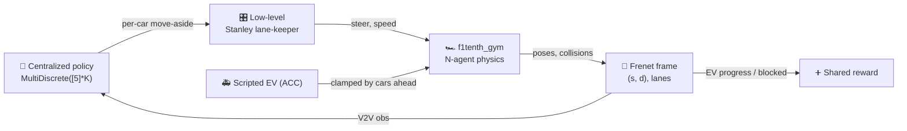

# Collaborative Autonomous Traffic Clearance

> Multiple 1/10-scale autonomous cars cooperatively open a corridor for an emergency vehicle —
> coordinating over vehicle-to-vehicle communication, with reinforcement learning that learns
> *when and how* to move aside.

-22314E?logo=ros&logoColor=white)


An emergency vehicle (EV) broadcasts its location and intent over V2V ahead of time; the ordinary
cars around it each run a learned policy that times a **move-aside** so the EV never has to slow down.
Originally a **2020 graduation project** on ROS Kinetic / Gazebo 7 / Python 2, it is being migrated
to a maintained **ROS 2 Humble / Python 3** stack built on
[`f1tenth_gym`](https://github.com/f1tenth/f1tenth_gym) — **gym-first**, with the cooperative
EV-clearing problem layered on top of the N-agent racing simulator.

## Status

| Line | State |
|------|-------|
| **v1.0.0** — ROS 2 / Python 3 (this `master`) | **in progress** (gym-first): **M0 done** (gym base), **M1 done** (`ClearanceEnv` + baselines + headroom gate), **M2 next** (train with stable-baselines3) |
| **v0.x** — ROS 1 Kinetic / Python 2 (legacy) | frozen at tags `v0.1.0`–`v0.3.0`; `git checkout v0.3.0` for the full Gazebo project. Removed from `master` in M1 ([ADR 0003](docs/adr/0003-refactor-in-place-preserve-legacy-with-tags.md)); its docs are in [`docs/legacy/`](docs/legacy/) |

The migration decisions and their rationale are recorded as **Architecture Decision Records** in
[`docs/adr/`](docs/adr/); improvement ideas in [`ROADMAP.md`](ROADMAP.md).

## Prerequisites — install Docker

Everything runs in Docker — **nothing is installed on your host**. You only need **Docker Engine**
plus the **Compose plugin**. On Debian/Ubuntu the distro packages are enough:

```bash
sudo apt-get update
sudo apt-get install -y docker.io docker-compose-v2 docker-buildx
sudo systemctl enable --now docker      # start the daemon now, and on every boot
sudo usermod -aG docker "$USER"         # so you can run docker without sudo
```

> **Important — the `docker` group only takes effect in a *new login session*.** After
> `usermod -aG docker`, **reboot or fully log out and back in** (a new terminal window is not enough;
> on Ubuntu 25.10+/26.04 the classic `newgrp`/`sg` work-around is no longer installed). Verify with
> `docker run --rm hello-world`. Any recent Docker works — validated on Ubuntu 26.04 with `docker.io` 29.x.

## Quickstart (v1.0.0)

```bash
git clone https://github.com/MohammedEl-sayedAhmed/collaborative-autonomous-traffic-clearance.git
cd collaborative-autonomous-traffic-clearance

./run.sh gym-build          # build the Python 3 image (pins f1tenth_gym @ v1.0.0)   (~3–5 min)
./run.sh gym-smoke          # M0: prove the gym base runs headless -> "OK: gym base runs headless."
./run.sh clearance-smoke    # M1: prove the scenario has real headroom (naive << ideal)
./run.sh gym-test           # M1: unit tests (frenet / controllers / termination / headroom)
```

`./run.sh` with no arguments prints every command.

## M1 — the ClearanceEnv

`ClearanceEnv` (a Gymnasium wrapper over `f1tenth_gym`, **no fork**) turns the bare N-car racetrack
into the cooperative problem: one **scripted EV** (`agent_0`) must clear a virtual 3-lane road on
which **K cooperators** we control are staggered in its lane.



- **Blocking = adaptive cruise on wide lanes** (ADR 0007). Cooperators cruise slow; the EV runs an ACC
  law, so a car left in its lane clamps it to a graded, **crash-free** convoy speed, while a timely
  move-aside lets it **sprint** — a robust ~4× speed ratio that gives the learner a dense gradient.
- **Staggered** cooperators mean return is **monotone** in how many yield in time — which defeats by
  construction the "saturation trap" (where even random ≈ optimal) that hid every algorithm difference
  in the 2020 toy harness.
- A **pre-training headroom gate** (`./run.sh clearance-smoke`) proves the naive-vs-ideal gap *before*
  any training is spent, and **exits non-zero** if the gap is absent.

Baselines log to the dashboard so you can see the band a learner must climb:

```bash
./run.sh clearance-eval --policy naive  --preset easy --episodes 20
./run.sh clearance-eval --policy ideal  --preset easy --episodes 20
./run.sh dashboard      # compare at http://127.0.0.1:8770
```

Full design: [`docs/design/m1-clearance-env.md`](docs/design/m1-clearance-env.md) and
[ADR 0007](docs/adr/0007-m1-clearance-env-design.md).

## Training dashboard

A live, zero-dependency dashboard to watch training and compare runs (tagged by commit) — it reads the
JSONL that `clearance-eval` (and, in M2, training) writes, so it is **stack-agnostic** and carries over
from the legacy line unchanged.


*(Shown: the legacy RL fix-by-fix campaign — success 3% → 100%. In v1.0.0 the same dashboard shows the
naive / random / ideal band for `ClearanceEnv`.)*

```bash
./run.sh dashboard-demo && ./run.sh dashboard    # try it now with synthetic runs
```

See [docs/DASHBOARD.md](docs/DASHBOARD.md) and [docs/DASHBOARD_GUIDE.md](docs/DASHBOARD_GUIDE.md).

## Legacy (2020 ROS 1 / Gazebo project)

The original project — Gazebo simulation, V2V (`racecar_communication`), a custom `move_base` costmap
layer, the `move_car` action stack, AMCL/gmapping, and the headline single-agent Q-learning
move-aside — is **preserved, buildable, at the tags**:

```bash
git checkout v0.3.0     # the full ROS 1 / Gazebo project + its run.sh sim|nav|movecar|ev|rl|…
```

Its documentation is in [`docs/legacy/`](docs/legacy/) (architecture, subsystems, packages, running,
known issues, RL experiments). It was removed from `master` in M1 per
[ADR 0003](docs/adr/0003-refactor-in-place-preserve-legacy-with-tags.md).

## Thesis

The graduation thesis is kept in a separate **private** repository and included here as a git submodule
at [`thesis/`](thesis/) (access-restricted). With access:

```bash
git submodule update --init thesis
./run.sh thesis        # compile -> thesis/main.pdf (Dockerized TeX Live)
```

## Repository layout

```
collaborative-autonomous-traffic-clearance/
├── run.sh                     # containerized runner — the one entry point (v1.0.0)
├── pyproject.toml             # the caatc package (pins f1tenth_gym @ v1.0.0)
├── caatc/                     # v1.0.0 Python 3 package — the RL core on f1tenth_gym
│   ├── clearance_env.py       #   M1 ClearanceEnv (cooperative EV-clearing wrapper)
│   ├── scenario.py            #   scenario config + EASY/HARD presets + track builder
│   ├── frenet.py              #   centerline frenet frame (s, d, lanes)
│   ├── controllers.py         #   Stanley lane-keeper + scripted EV (ACC)
│   ├── baselines.py           #   naive / random / ideal reference policies
│   ├── clearance_eval.py      #   evaluate + log dashboard runs
│   ├── clearance_smoke.py     #   the pre-training headroom gate
│   ├── smoke.py               #   M0 headless smoke
│   └── tests/                 #   unit tests
├── docker/                    # gym.Dockerfile (dev image) + gym-test.Dockerfile
├── tools/dashboard/           # stack-agnostic training dashboard (reads JSONL runs)
├── docs/adr/                  # Architecture Decision Records (the migration)
├── docs/design/               # design docs (the M1 ClearanceEnv design)
├── docs/legacy/               # docs for the tagged 2020 ROS 1 / Gazebo stack
└── thesis/                    # graduation thesis (private submodule; ./run.sh thesis)
```

## Documentation

| Doc | Contents |
|-----|----------|
| [adr/](docs/adr/) | Architecture Decision Records — the ROS 2 / Python 3 migration decisions and rationale |
| [design/m1-clearance-env.md](docs/design/m1-clearance-env.md) | The M1 ClearanceEnv design (scenario, ACC headroom, V2V obs, reward, verification) |
| [DASHBOARD.md](docs/DASHBOARD.md) | Live training dashboard: stream metrics, compare runs across code changes |
| [DASHBOARD_GUIDE.md](docs/DASHBOARD_GUIDE.md) | Plain-language guide to reading the dashboard (RL, episode, epsilon…) |
| [legacy/](docs/legacy/) | The 2020 ROS 1 / Gazebo stack (architecture, subsystems, packages, running, RL experiments) |
| [ROADMAP.md](ROADMAP.md) | Improvement ideas — RL, simulation, stack, and the dashboard |

## Origin & credits

Graduation project (2020), *Collaborative Autonomous Traffic Clearance*, built by
[Nadine Amr](https://github.com/nadine-amin),
[Tasneem Omara](https://github.com/TasneemOmara), and
[Mohammed El-sayed Ahmed](https://github.com/MohammedEl-sayedAhmed) on top of the
[UPenn F1TENTH Fall 2018 skeletons](https://github.com/mlab-upenn/f110-fall2018-skeletons) and the
MIT `racecar-simulator`. The ROS 2 / Python 3 migration onto `f1tenth_gym` is ongoing.

## License

GPL-3.0 — see [LICENSE](LICENSE). Upstream `f1tenth_gym`, `racecar-simulator`, and ROS navigation
components retain their original licenses.
