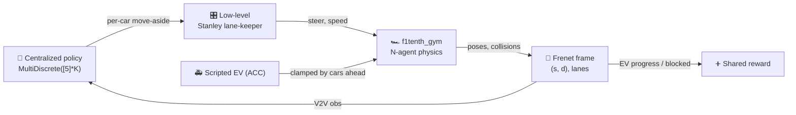

# Collaborative Autonomous Traffic Clearance

> Multiple 1/10-scale autonomous cars cooperatively open a corridor for an emergency vehicle —
> coordinating over vehicle-to-vehicle communication, with reinforcement learning that learns
> *when and how* to move aside.

-22314E?logo=ros&logoColor=white)


An emergency vehicle (EV) broadcasts its location and intent over V2V ahead of time; the ordinary
cars around it each run a learned policy that times a **move-aside** so the EV never has to slow down.
Originally a **2020 graduation project** on ROS Kinetic / Gazebo 7 / Python 2, it is being migrated
to a maintained **ROS 2 Humble / Python 3** stack built on
[`f1tenth_gym`](https://github.com/f1tenth/f1tenth_gym) — **gym-first**, with the cooperative
EV-clearing problem layered on top of the N-agent racing simulator.

## Status

| Line | State |
|------|-------|
| **v1.0.0** — ROS 2 / Python 3 (this `master`) | **in progress** (gym-first): **M0 done** (gym base), **M1 done** (`ClearanceEnv` + baselines + headroom gate), **M2 done** (PPO matches the scripted oracle on **both** EASY and HARD), **M3 done** (decentralized execution equals centralized on STRICT and HARD) |
| **v0.x** — ROS 1 Kinetic / Python 2 (legacy) | frozen at tags `v0.1.0`–`v0.3.0`; `git checkout v0.3.0` for the full Gazebo project. Removed from `master` in M1 ([ADR 0003](docs/adr/0003-refactor-in-place-preserve-legacy-with-tags.md)); its docs are in [`docs/legacy/`](docs/legacy/) |

The migration decisions and their rationale are recorded as **Architecture Decision Records** in
[`docs/adr/`](docs/adr/); improvement ideas in [`ROADMAP.md`](ROADMAP.md).

## Prerequisites — install Docker

Everything runs in Docker — **nothing is installed on your host**. You only need **Docker Engine**
plus the **Compose plugin**. On Debian/Ubuntu the distro packages are enough:

```bash
sudo apt-get update
sudo apt-get install -y docker.io docker-compose-v2 docker-buildx
sudo systemctl enable --now docker      # start the daemon now, and on every boot
sudo usermod -aG docker "$USER"         # so you can run docker without sudo
```

> **Important — the `docker` group only takes effect in a *new login session*.** After
> `usermod -aG docker`, **reboot or fully log out and back in** (a new terminal window is not enough;
> on Ubuntu 25.10+/26.04 the classic `newgrp`/`sg` work-around is no longer installed). Verify with
> `docker run --rm hello-world`. Any recent Docker works — validated on Ubuntu 26.04 with `docker.io` 29.x.

## Quickstart (v1.0.0)

```bash
git clone https://github.com/MohammedEl-sayedAhmed/collaborative-autonomous-traffic-clearance.git
cd collaborative-autonomous-traffic-clearance

./run.sh gym-build          # build the Python 3 image (pins f1tenth_gym @ v1.0.0)   (~3–5 min)
./run.sh gym-smoke          # M0: prove the gym base runs headless -> "OK: gym base runs headless."
./run.sh clearance-smoke    # M1: prove the scenario has real headroom (naive << ideal)
./run.sh gym-test           # M1: unit tests (frenet / controllers / termination / headroom)
```

`./run.sh` with no arguments prints every command.

## M1 — the ClearanceEnv

`ClearanceEnv` (a Gymnasium wrapper over `f1tenth_gym`, **no fork**) turns the bare N-car racetrack
into the cooperative problem: one **scripted EV** (`agent_0`) must clear a virtual 3-lane road on
which **K cooperators** we control are staggered in its lane.



- **Blocking = adaptive cruise on wide lanes** (ADR 0007). Cooperators cruise slow; the EV runs an ACC
  law, so a car left in its lane clamps it to a graded, **crash-free** convoy speed, while a timely
  move-aside lets it **sprint** — a robust ~4× speed ratio that gives the learner a dense gradient.
- **Staggered** cooperators mean return is **monotone** in how many yield in time — which defeats by
  construction the "saturation trap" (where even random ≈ optimal) that hid every algorithm difference
  in the 2020 toy harness.
- A **pre-training headroom gate** (`./run.sh clearance-smoke`) proves the naive-vs-ideal gap *before*
  any training is spent, and **exits non-zero** if the gap is absent.

Baselines log to the dashboard so you can see the band a learner must climb:

```bash
./run.sh clearance-eval --policy naive  --preset easy --episodes 20
./run.sh clearance-eval --policy ideal  --preset easy --episodes 20
./run.sh dashboard      # compare at http://127.0.0.1:8770
```

Full design: [`docs/design/m1-clearance-env.md`](docs/design/m1-clearance-env.md) and
[ADR 0007](docs/adr/0007-m1-clearance-env-design.md).

## M2 — training it (PPO)

One centralized **PPO** agent (stable-baselines3) picks the joint move-aside action for all K
cooperators; the EV stays scripted. Training streams every episode to the dashboard in the same
format the baselines use, and the trained policy is evaluated through the *same* code path as the
baselines — so the comparison below is apples-to-apples ([ADR 0008](docs/adr/0008-train-with-stable-baselines3-ppo.md)).

```bash
./run.sh clearance-smoke                        # never train an unproven scenario
./run.sh train-build                            # image: + stable-baselines3, CPU-only torch
./run.sh clearance-train --preset easy --timesteps 300000 --n-envs 8
./run.sh dashboard                              # watch it climb the baseline band, live
```

**Result on EASY** (20 greedy episodes each; 300k steps ≈ 16 min on 8 CPU cores):

| policy | success | collisions | mean `t_clear` | EV mean speed | lane changes | return |
|--------|--------:|-----------:|---------------:|--------------:|-------------:|-------:|
| `naive` (nobody yields) | 0% | 0% | — *(times out)* | 2.29 m/s | 0 | 31.4 |
| `random` | 30% | 45% | 11.67 s | 3.50 m/s | 80.8 | −2.0 |
| `ideal` (scripted oracle) | 100% | 0% | 6.13 s | 7.31 m/s | 3.0 | 102.2 |
| **PPO (learned)** | **100%** | **0%** | **6.00 s** | **7.44 m/s** | **3.0** | **102.3** |

The learned policy **matches the scripted oracle** — same 100% success with zero collisions, a
marginally faster clearance, and exactly K=3 lane changes (one per cooperator: it learned to yield
once, at the right moment, rather than oscillating the way `random` does at 80 changes an episode).
Against the naive floor the emergency vehicle moves **3.2× faster** and clears a route it otherwise
never finishes.

**Result on HARD** (250k steps; each cooperator has one adjacent side lane blocked, so the free side
has to be read from the V2V occupancy features — guessing collides):

| policy | success | collisions | mean `t_clear` | EV mean speed | return |
|--------|--------:|-----------:|---------------:|--------------:|-------:|
| `naive` | 0% | 0% | — *(times out)* | 2.29 m/s | 31.4 |
| `random` | 25% | **60%** | 11.78 s | 3.65 m/s | −24.4 |
| `ideal` (scripted oracle) | 100% | 0% | 6.13 s | 7.30 m/s | 102.2 |
| **PPO (learned)** | **100%** | **0%** | **6.00 s** | **7.43 m/s** | **102.3** |

`random` collides in 60% of HARD episodes by merging into an occupied lane; the learned policy never
does. This is the 2020 project's "blocker" scenario — which its tabular agent could not solve —
now solved from the V2V observation alone.

## M3 — decentralizing it

M2's controller is still centralized: one network reads all K cooperators and emits all their actions.
M3 takes the joint view away — each car decides from **its own 26-feature observation** (own sensing +
the V2V broadcasts in range), one shared network evaluated K times, **no global state at execution**
([ADR 0009](docs/adr/0009-decentralized-execution-ippo.md)).

```bash
./run.sh clearance-smoke --m3     # is the per-agent view sufficient? (a scripted local oracle)
./run.sh dec-smoke                # is the plumbing faithful and the view really local?
./run.sh clearance-train-dec --preset strict --timesteps 900000 --n-envs 8
```

Because M2 already sits at the oracle ceiling, M3 is **not** an improvement claim — it is *equality
under information restriction*, backed by gates that fail if any global state is read, plus two
capabilities a joint controller structurally cannot have:

| | M2 centralized | **M3 decentralized** |
|---|---|---|
| **STRICT** (convoying impossible) | 100%, 0 collisions, `t_clear` 6.13 s, **3.0 yields** | **identical — and equal to the oracle** |
| HARD | 100%, 0 collisions, `t_clear` 6.00 s | **identical** (both reach the free-flow optimum) |
| EASY (50 shared seeds) | 100%, 0 collisions, `t_clear` **6.00 s** | 100%, 0 collisions, `t_clear` 6.58 s (+9.7%) — **6.02 s (+0.33%) with `--central-critic`** |
| same weights at K=4 | impossible (action space fixed at K) | 100%, `t_clear` 6.48 s |
| 50% of V2V broadcasts lost | not expressible | 100%, `t_clear` 6.80 s |

Each car can even run as **its own OS process**, receiving only its own observation over a pipe, and
reproduce the in-process metrics — the end-to-end proof that nothing shared is required.

The EASY row turned out to be a statement about the **scenario**, not about decentralization. Because
the EV follows whatever is in front of it, cooperators that merely *speed up* let it through **without
anyone yielding** — 100% success at ~95% of the oracle's return. So **success rate alone cannot tell
cooperation from convoying; only clearance time can.** The decentralized policy was partially taking
that shortcut on EASY (2.3 yields instead of 3.0).

The **STRICT** preset ([ADR 0010](docs/adr/0010-strict-preset-removes-the-convoying-substitution.md))
removes the substitution — a cooperator is speed-capped while still in the EV's lane, so you cannot
outrun the ambulance in its own lane — and there the same learner yields **3.0/3.0 and matches the
oracle exactly**. EASY and HARD keep their published numbers, and `--policy speedup` plus two gate
checks keep the substitution permanently visible.

Two independent fixes each close the EASY gap, which is what makes the diagnosis credible: removing
the shortcut (STRICT), **or** giving the critic the joint state during training while the actor still
sees only its own view (`--central-critic`, which reaches 6.02 s and 3.0 yields with the shortcut still
available). Full analysis:
[`docs/design/m3-decentralized-execution.md`](docs/design/m3-decentralized-execution.md).

## Watching it

Training is headless, but any policy can be replayed as a top-down scene — recorded to an mp4
(offscreen, no display needed) or shown in a live window:

```bash
./run.sh clearance-watch --policy naive                              # the blocked baseline -> mp4
./run.sh clearance-watch --model saved_variables/models/ppo-easy.zip # the trained policy -> mp4
./run.sh clearance-watch --model saved_variables/models/ppo-hard.zip --preset hard
./run.sh view-build                                                  # once: X11 libs for a window
./run.sh clearance-watch --policy ideal --mode human                 # a live window
```

The view unrolls the road into a straight strip (the lanes are frenet offsets, so this is the
scenario's natural frame), colours each cooperator by whether it has cleared the EV lane, and shows
the ACC state — the whole mechanism at a glance: **BLOCKED — held at convoy speed** versus
**CLEAR — sprinting**.

## Training dashboard

A live, zero-dependency dashboard to watch training and compare runs (tagged by commit) — it reads the
JSONL that `clearance-eval` (and, in M2, training) writes, so it is **stack-agnostic** and carries over
from the legacy line unchanged.


*(Shown: the legacy RL fix-by-fix campaign — success 3% → 100%. In v1.0.0 the same dashboard shows the
naive / random / ideal band for `ClearanceEnv`.)*

```bash
./run.sh dashboard-demo && ./run.sh dashboard    # try it now with synthetic runs
```

See [docs/DASHBOARD.md](docs/DASHBOARD.md) and [docs/DASHBOARD_GUIDE.md](docs/DASHBOARD_GUIDE.md).

## Legacy (2020 ROS 1 / Gazebo project)

The original project — Gazebo simulation, V2V (`racecar_communication`), a custom `move_base` costmap
layer, the `move_car` action stack, AMCL/gmapping, and the headline single-agent Q-learning
move-aside — is **preserved, buildable, at the tags**:

```bash
git checkout v0.3.0     # the full ROS 1 / Gazebo project + its run.sh sim|nav|movecar|ev|rl|…
```

Its documentation is in [`docs/legacy/`](docs/legacy/) (architecture, subsystems, packages, running,
known issues, RL experiments). It was removed from `master` in M1 per
[ADR 0003](docs/adr/0003-refactor-in-place-preserve-legacy-with-tags.md).

## Thesis

The graduation thesis is kept in a separate **private** repository and included here as a git submodule
at [`thesis/`](thesis/) (access-restricted). With access:

```bash
git submodule update --init thesis
./run.sh thesis        # compile -> thesis/main.pdf (Dockerized TeX Live)
```

## Repository layout

```
collaborative-autonomous-traffic-clearance/
├── run.sh                     # containerized runner — the one entry point (v1.0.0)
├── pyproject.toml             # the caatc package (pins f1tenth_gym @ v1.0.0)
├── caatc/                     # v1.0.0 Python 3 package — the RL core on f1tenth_gym
│   ├── clearance_env.py       #   M1 ClearanceEnv (cooperative EV-clearing wrapper)
│   ├── scenario.py            #   scenario config + EASY/HARD presets + track builder
│   ├── frenet.py              #   centerline frenet frame (s, d, lanes)
│   ├── controllers.py         #   Stanley lane-keeper + scripted EV (ACC)
│   ├── baselines.py           #   naive / random / ideal reference policies
│   ├── clearance_eval.py      #   evaluate + log dashboard runs
│   ├── clearance_smoke.py     #   the pre-training headroom gate
│   ├── train.py               #   M2 PPO training + live dashboard logging
│   ├── train_dec.py           #   M3 decentralized training (shared IPPO, optional CTDE)
│   ├── decentralized.py       #   M3 per-car policies + the local-only enforcement view
│   ├── obs_spec.py            #   the per-agent observation wire format
│   ├── vec_agents.py          #   N joint envs -> N*K single-agent streams
│   ├── central_critic.py      #   CTDE: local actor, joint critic (training only)
│   ├── pz_env.py              #   PettingZoo ParallelEnv seam (external MARL)
│   ├── proc_fleet.py          #   one OS process per car (the decentralization proof)
│   ├── dec_smoke.py           #   the M3 interface + locality gate
│   ├── play.py                #   replay a policy: mp4 or a live window
│   ├── render2d.py            #   the top-down scene renderer
│   ├── smoke.py               #   M0 headless smoke
│   └── tests/                 #   unit tests
├── docker/                    # gym (dev) + gym-test + gym-train (SB3) + gym-view (X11)
├── tools/dashboard/           # stack-agnostic training dashboard (reads JSONL runs)
├── docs/adr/                  # Architecture Decision Records (the migration)
├── docs/design/               # design docs (the M1 ClearanceEnv design)
├── docs/legacy/               # docs for the tagged 2020 ROS 1 / Gazebo stack
└── thesis/                    # graduation thesis (private submodule; ./run.sh thesis)
```

## Documentation

| Doc | Contents |
|-----|----------|
| [adr/](docs/adr/) | Architecture Decision Records — the ROS 2 / Python 3 migration decisions and rationale |
| [design/m1-clearance-env.md](docs/design/m1-clearance-env.md) | The M1 ClearanceEnv design (scenario, ACC headroom, V2V obs, reward, verification) |
| [adr/0008](docs/adr/0008-train-with-stable-baselines3-ppo.md) | Why M2 trains with stable-baselines3 PPO on the centralized joint action |
| [design/m3-decentralized-execution.md](docs/design/m3-decentralized-execution.md) | The M3 decentralization design, its gates, and the measured results |
| [adr/0009](docs/adr/0009-decentralized-execution-ippo.md) | Why M3 decentralizes with a parameter-shared per-agent policy (IPPO) |
| [adr/0010](docs/adr/0010-strict-preset-removes-the-convoying-substitution.md) | Why a STRICT preset was added: convoying must not substitute for yielding |
| [DASHBOARD.md](docs/DASHBOARD.md) | Live training dashboard: stream metrics, compare runs across code changes |
| [DASHBOARD_GUIDE.md](docs/DASHBOARD_GUIDE.md) | Plain-language guide to reading the dashboard (RL, episode, epsilon…) |
| [legacy/](docs/legacy/) | The 2020 ROS 1 / Gazebo stack (architecture, subsystems, packages, running, RL experiments) |
| [ROADMAP.md](ROADMAP.md) | Improvement ideas — RL, simulation, stack, and the dashboard |

## Origin & credits

Graduation project (2020), *Collaborative Autonomous Traffic Clearance*, built by
[Nadine Amr](https://github.com/nadine-amin),
[Tasneem Omara](https://github.com/TasneemOmara), and
[Mohammed El-sayed Ahmed](https://github.com/MohammedEl-sayedAhmed) on top of the
[UPenn F1TENTH Fall 2018 skeletons](https://github.com/mlab-upenn/f110-fall2018-skeletons) and the
MIT `racecar-simulator`. The ROS 2 / Python 3 migration onto `f1tenth_gym` is ongoing.

## License

GPL-3.0 — see [LICENSE](LICENSE). Upstream `f1tenth_gym`, `racecar-simulator`, and ROS navigation
components retain their original licenses.
