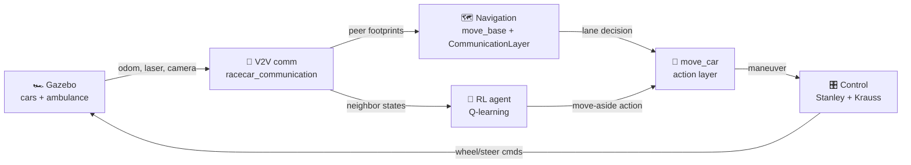
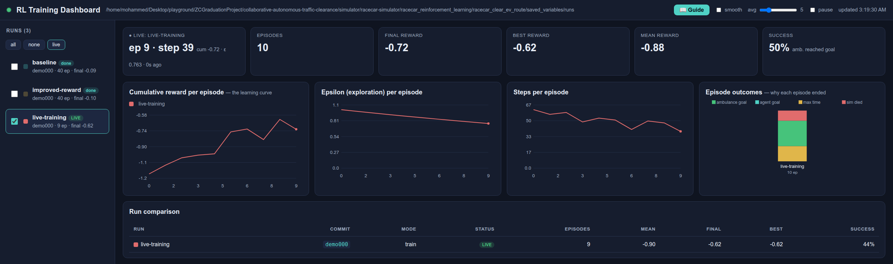
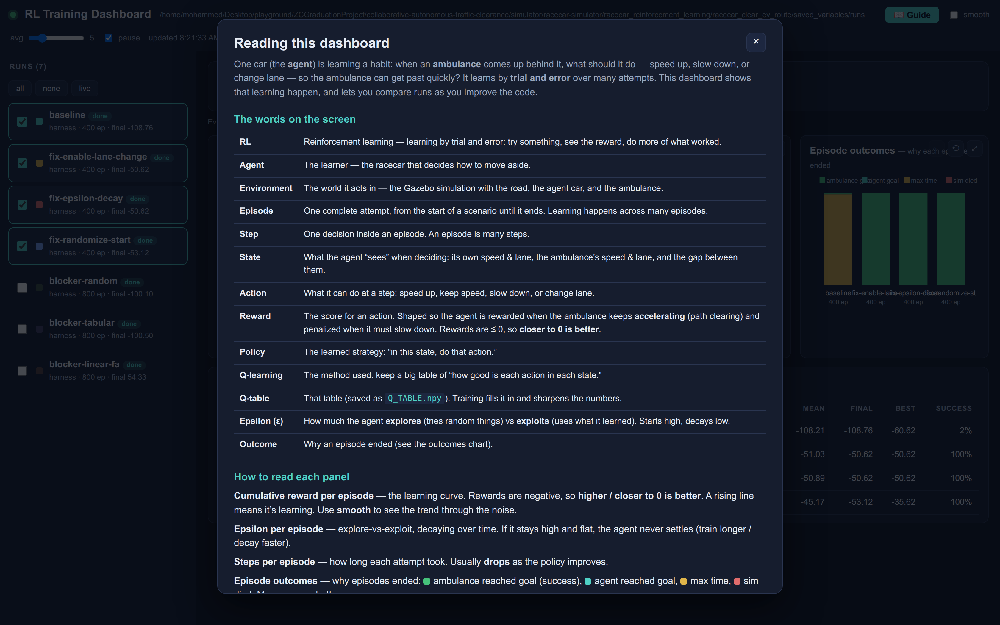
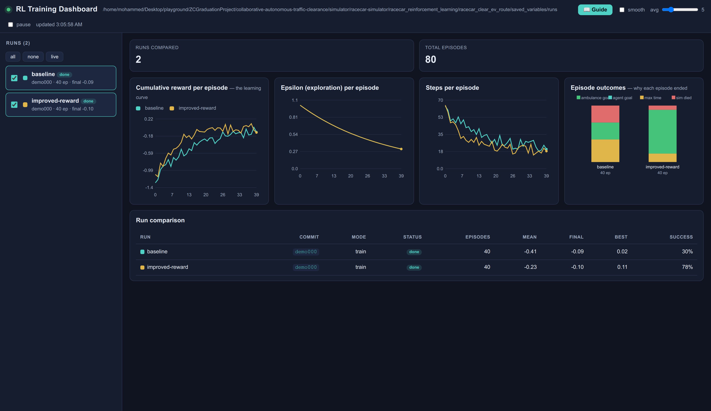

# Collaborative Autonomous Traffic Clearance

> Multiple 1/10-scale autonomous cars cooperatively open a corridor for an emergency vehicle —
> coordinating over vehicle-to-vehicle communication, with a reinforcement-learning agent that
> learns *when and how* to move aside.


This is a 2020 graduation project built on the F1TENTH / MIT `racecar-simulator`. Several Ackermann
racecars share a three-lane road; when an **ambulance** approaches, the cars must collaborate to
clear its path. The problem is decentralized — no car sees all the others — so each vehicle
broadcasts its state over a shared V2V channel, a **custom costmap layer** turns those broadcasts
into planning constraints, and a **tabular Q-learning** agent learns the move-aside policy.

## At a glance



- **Decentralized V2V communication** — each car broadcasts identity, pose, lane, motion limits and
  body footprint on one shared channel; receivers range-gate and fuse peers into a shared world model.
- **A custom `costmap_2d::CommunicationLayer`** — stamps peers' broadcast footprints into each car's
  `move_base` costmap as lethal obstacles, so cars plan around each other without line of sight.
- **A `MoveCar` action layer** — one discrete maneuver vocabulary (lane keep / left / right +
  acceleration) that either classical navigation *or* the RL policy can drive, with arbitration.
- **Reinforcement learning** — a single-agent tabular Q-learning policy, rewarded for keeping the
  ambulance accelerating, running in a Gazebo-backed environment that re-renders each episode via
  jinja2.

See **[docs/ARCHITECTURE.md](docs/ARCHITECTURE.md)** for the full data-flow diagram and a
step-by-step walkthrough of one "clear the route" episode.

## Quickstart

Everything runs in Docker — **nothing is installed on your host** (ROS Kinetic can't run on a modern
distro anyway). You only need Docker + Docker Compose.

```bash
git clone https://github.com/MohammedEl-sayedAhmed/collaborative-autonomous-traffic-clearance.git
cd collaborative-autonomous-traffic-clearance

./run.sh build-image     # ROS Kinetic + all deps + baked Gazebo models  (~5 min)
./run.sh build           # catkin_make the workspace inside the container (~15 min)
./run.sh sim             # Gazebo + one car you can drive with w/a/s/d
```

`./run.sh` with no arguments prints every command. Full details, the verified demo matrix, and
troubleshooting are in **[docs/RUNNING.md](docs/RUNNING.md)**.

## Demos

| Command | Scenario |
|---------|----------|
| `./run.sh sim` / `sim2` / `sim4` | 1 / 2 / 4 cars in Gazebo (multi-car adds V2V communication) |
| `./run.sh nav` | Navigation: `move_base` + AMCL + RViz |
| `./run.sh movecar` | The lane-keeping / lane-changing action stack |
| `./run.sh ev` | One racecar + one ambulance |
| `./run.sh rl` | Q-learning move-aside training (see [RUNNING.md](docs/RUNNING.md#running-the-rl-scenario)) |
| `./run.sh dashboard` | Live training dashboard — compare runs across your RL/env changes ([DASHBOARD.md](docs/DASHBOARD.md)) |

All demos were run and verified during documentation — see the status matrix and per-demo caveats in
[docs/RUNNING.md](docs/RUNNING.md) and [docs/KNOWN_ISSUES.md](docs/KNOWN_ISSUES.md).

## Training dashboard

A live, zero-dependency dashboard to watch training and see how each change to the RL or the
environment moves the numbers — runs are tagged by git commit and compared side by side.


Here the fix-by-fix campaign: the *baseline* barely clears the ambulance, and each fix from
[KNOWN_ISSUES](docs/KNOWN_ISSUES.md) pushes success from **3% → 100%**. It updates **live** while
training runs, and a built-in **Guide** explains every term (RL, Q-table, episode, epsilon…).

<p>
  
  
</p>

```bash
./run.sh dashboard-demo && ./run.sh dashboard    # try it now with synthetic runs, at http://127.0.0.1:8770
```

See [docs/DASHBOARD.md](docs/DASHBOARD.md) and [docs/DASHBOARD_GUIDE.md](docs/DASHBOARD_GUIDE.md).
The charts are interactive (hover for values, scroll / drag to zoom, back/reset, maximize).

### See each fix improve the results

Run the built-in campaign — baseline, then each fix from [KNOWN_ISSUES](docs/KNOWN_ISSUES.md) applied
cumulatively (the shot above) — with a fast headless harness; no Gazebo needed:

```bash
./run.sh campaign && ./run.sh dashboard
```

Enabling the (previously disabled) lane-change maneuver jumps success from **3% → 100%**; ε-decay and
randomized starts refine it further. The same fixes are toggleable in the real Gazebo pipeline.

### Beyond the fixes: a smarter agent

An enriched **"blocker" scenario** gives the agent a real decision — read which side lane is clear
(V2V awareness), then move aside *without crashing*. A **linear function-approximation** agent solves
it where the sparse tabular Q-table can't:

```bash
./run.sh rl-blocker && ./run.sh dashboard
```



Greedy learned-policy success climbs **random 2% → tabular 9% → linear FA 100%** — full guide:
[docs/RL_EXPERIMENTS.md](docs/RL_EXPERIMENTS.md).

## Thesis

The graduation thesis is kept in a separate **private** repository and included
here as a git submodule at [`thesis/`](thesis/) (access-restricted). With access:

```bash
git submodule update --init thesis
./run.sh thesis        # compile -> thesis/main.pdf (Dockerized TeX Live)
```

## Repository layout

```
collaborative-autonomous-traffic-clearance/
├── run.sh                     # containerized runner — the one entry point
├── docker/                    # Dockerfile (ROS Kinetic + deps + Gazebo models) + entrypoint
├── docker-compose.yml         # image + volumes + X11/GPU wiring
├── docs/                      # ARCHITECTURE / SUBSYSTEMS / PACKAGES / RUNNING / KNOWN_ISSUES
├── thesis/                    # graduation thesis (private submodule; ./run.sh thesis)
├── simulator/racecar-simulator/
│   ├── racecar_gazebo, racecar_description        # simulation + robot/ambulance models
│   ├── racecar_communication                      # V2V broadcast + aggregation
│   ├── racecar_navigation, navigation_/           # move_base + custom CommunicationLayer
│   ├── racecar_move_car                           # MoveCar action layer
│   ├── racecar_control                            # Stanley / Krauss / lane keeping / teleop
│   ├── racecar_localization, racecar_mapping      # AMCL / gmapping
│   └── racecar_reinforcement_learning/            # Q-learning agent + environment
└── system/                    # MIT racecar hardware bringup (vesc, ackermann_cmd_mux, ...)
```

## Documentation

| Doc | Contents |
|-----|----------|
| [ARCHITECTURE.md](docs/ARCHITECTURE.md) | Layered architecture, system data-flow diagram, one end-to-end episode, the RL loop |
| [SUBSYSTEMS.md](docs/SUBSYSTEMS.md) | Mechanism of each layer (simulation, V2V, navigation, move_car, control, RL) |
| [PACKAGES.md](docs/PACKAGES.md) | All 36 packages + every custom message / service / action |
| [RUNNING.md](docs/RUNNING.md) | Containerized setup, every demo, the RL run order, troubleshooting |
| [KNOWN_ISSUES.md](docs/KNOWN_ISSUES.md) | Verified issues, applied fixes, and behaviour-changing fixes left for review |
| [DASHBOARD.md](docs/DASHBOARD.md) | Live training dashboard: stream metrics, compare runs across code changes |
| [DASHBOARD_GUIDE.md](docs/DASHBOARD_GUIDE.md) | Plain-language guide to reading the dashboard (RL, Q-table, episode, epsilon…) |
| [RL_EXPERIMENTS.md](docs/RL_EXPERIMENTS.md) | Run the fix-by-fix campaign (fast headless harness + real Gazebo) and compare results |
| [ROADMAP.md](ROADMAP.md) | Improvement ideas — project first (RL, sim, stack), then the dashboard accordingly |

## Origin & credits

Graduation project (2020), *Collaborative Autonomous Traffic Clearance*, built by
[Nadine Amr](https://github.com/nadine-amin),
[Tasneem Omara](https://github.com/TasneemOmara), and
[Mohammed El-sayed Ahmed](https://github.com/MohammedEl-sayedAhmed) on top of the
[UPenn F1TENTH Fall 2018 skeletons](https://github.com/mlab-upenn/f110-fall2018-skeletons) and the
MIT `racecar-simulator`. The containerization and documentation in this repository were added later
to make the six-year-old ROS Kinetic project reproducible on modern machines.

## License

GPL-3.0 — see [LICENSE](LICENSE). Upstream `racecar-simulator` and ROS navigation components retain
their original licenses.
