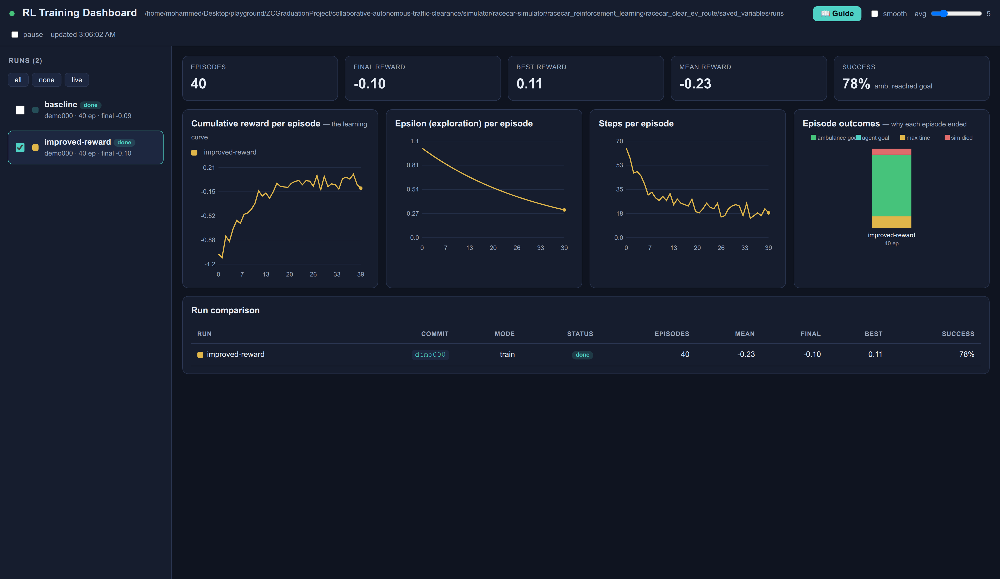

# Reading the dashboard — a plain-language guide

This guide explains, in simple terms, what the training dashboard is showing, the words it uses, and
how to navigate it. No prior reinforcement-learning background needed. (The same guide is available
inside the dashboard via the **📖 Guide** button.)

## The one-paragraph story

One of the cars (the **agent**) is trying to *learn a habit*: when an **ambulance** comes up behind
it, what should it do — speed up, slow down, or change lane — so the ambulance can get past quickly?
It learns by **trial and error** over many attempts. Each attempt is an **episode**. After each
attempt it gets a **score** (a **reward**) based on whether the ambulance was able to keep moving.
Over many episodes it gradually figures out a good strategy. The dashboard shows that learning
happening — and lets you compare "before" and "after" when you improve the code.

## Glossary (the words on the screen)

| Term | Plain meaning |
|------|---------------|
| **RL** (reinforcement learning) | Learning by trial and error: try something, see the reward, do more of what worked. |
| **Agent** | The learner — here, the racecar that decides how to move aside. |
| **Environment** | The world the agent acts in — here, the Gazebo simulation with the road, the agent car, and the ambulance. |
| **Episode** | One complete attempt, from the start of a scenario until it ends (ambulance gets through, someone reaches the goal, time runs out, or the sim dies). Learning happens across many episodes. |
| **Step** | One decision inside an episode. An episode is made of many steps. |
| **State** | What the agent "sees" when deciding: its own speed & lane, the ambulance's speed & lane, and the gap to the ambulance. |
| **Action** | What the agent can do at a step: speed up, keep speed, slow down, or change lane. |
| **Reward** | The score for an action. Here it's shaped so the agent is rewarded when the **ambulance keeps accelerating** (i.e. the path is clearing) and penalized when the ambulance has to slow down. Rewards are ≤ 0, so "closer to 0 is better." |
| **Policy** | The agent's learned strategy — "in this state, do that action." Training improves the policy. |
| **Q-learning** | The specific method used. It keeps a giant lookup table of "how good is each action in each state." |
| **Q-table** | That lookup table (saved as `Q_TABLE.npy`). Each cell is the learned value of taking one action in one state. Training fills it in and sharpens the numbers. |
| **Epsilon (ε)** | How much the agent **explores** (tries random things) vs **exploits** (uses what it has learned). ε starts high (mostly exploring) and decays toward low (mostly exploiting). |
| **Outcome** | Why an episode ended (see the outcomes chart below). |

## How to read each panel

**Cumulative reward per episode (the learning curve).**
The headline chart. X-axis = episode number, Y-axis = total reward for that episode. Because rewards
are negative, **higher / closer to zero = better**. A line that rises over time means the agent is
learning. Overlay two runs to see which learns faster or ends higher. Turn on **smooth** (top-right)
to average out the noise and see the trend.

**Epsilon (exploration) per episode.**
Shows the explore-vs-exploit balance decaying over time. Early on it's high (the agent is
experimenting); later it drops (the agent trusts its learned policy). If ε stays flat and high, the
agent never really "settles" — a sign to train for more episodes or increase the decay.

**Steps per episode.**
How many decisions each episode took. As the policy improves, episodes often get **shorter** (the
ambulance gets through faster), so a downward trend is usually good.

**Episode outcomes (why each episode ended).**
A stacked bar per run counting how episodes finished:
- 🟢 **ambulance reached goal** — success (the path was cleared). More green = better.
- 🟩 **agent reached goal** — the agent car finished its own route.
- 🟡 **max time** — ran out of time.
- 🔴 **sim died** — the simulation crashed/stalled that episode.

**Run comparison (table).**
One row per selected run: its git **commit**, number of **episodes**, and the **mean / final / best**
reward plus **success rate** (% of episodes where the ambulance reached its goal). This is where you
read off "did my change actually help?"

**Live tile.**
While a run is training, a tile shows the current episode, step, running reward, and ε — updating in
real time. A **LIVE** badge appears next to runs whose heartbeat is fresh.

## How to navigate

- **Click a run** in the left list (or its checkbox) to show/hide it. Selected runs are highlighted
  and appear in every chart and the table.
- **Compare** by selecting two or more runs — their curves overlay with a colour each.
- **all / none / live** — quick buttons to select every run, clear the selection, or show only
  currently-training runs.
- **smooth** + the **avg** slider — moving-average the learning curves to see the trend.
- **pause** — stop the 2-second auto-refresh (useful when inspecting).
- Every run is saved under `saved_variables/runs/` and persists, so you can always come back and
  compare an old run against a new one.

## What "good" looks like

A run that's learning well shows: the **reward curve rising** toward 0, **ε decaying**, **steps
decreasing**, and the **outcomes bar turning greener** (higher success rate) — and, when you compare,
your improved run sits **above** the baseline on the reward curve with a **higher success rate** in
the table.

> Reality check for this project: the shipped RL is a proof-of-concept (few episodes, lane changes
> disabled in code, fixed start position — see [KNOWN_ISSUES.md](KNOWN_ISSUES.md)). The dashboard is
> built to make those limitations visible and to measure the effect as you improve the RL and the
> environment.
