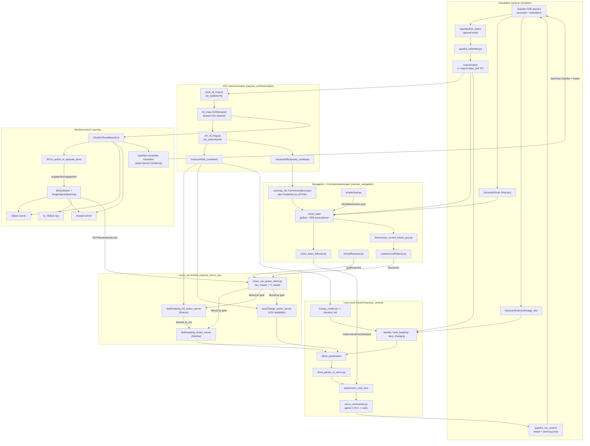
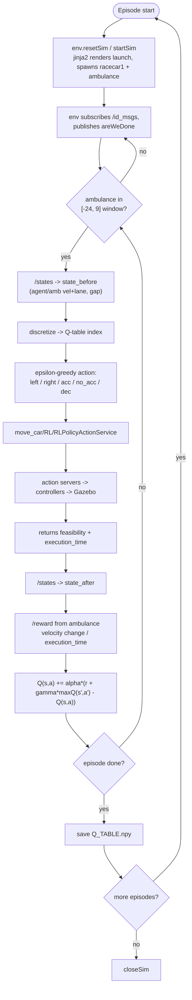

> **Legacy (ROS 1 / Python 2).** This describes the 2020 ROS Kinetic / Gazebo stack that was
> removed from `master` in M1 and preserved at tags `v0.1.0`–`v0.3.0`. See [docs/legacy/README.md](README.md)
> and `git checkout v0.3.0`.

# Architecture

Collaborative Autonomous Traffic Clearance is a layered ROS 1 (Kinetic) stack built on top of
the MIT / F1TENTH `racecar-simulator`. Several 1/10-scale Ackermann cars share a three-lane road
and cooperatively open a corridor for an approaching **ambulance**; a reinforcement-learning agent
learns *when and how* to move aside so the ambulance keeps accelerating toward its goal.

The problem is deliberately **decentralized**: no car has line-of-sight to all others, so every
vehicle continuously broadcasts its identity, pose, lane, motion limits, and body footprint over a
single shared vehicle-to-vehicle (V2V) channel. A custom costmap layer turns those broadcasts into
planning constraints, and an RL policy turns the shared world model into move-aside decisions.

## The six layers

| Layer | Packages | Responsibility |
|-------|----------|----------------|
| **Simulation** | `racecar_gazebo`, `racecar_description` | Gazebo (ODE) spawns 1–4 namespaced cars + the ambulance, supplies ground-truth odometry, laser + camera, and applies joint commands. |
| **Localization / Mapping** | `racecar_localization` (AMCL), `racecar_mapping` (gmapping) | Optional pose/map estimation; in practice `gazebo_odometry.py` supplies a perfect `map → base_link` transform. |
| **Communication (V2V)** | `racecar_communication` | Every car broadcasts identity/pose/lane/limits/footprint on one shared `/id_msgs`; per-car receivers range-gate and aggregate peers. |
| **Navigation** | `racecar_navigation`, vendored `navigation_/` | Per-car `move_base` (global planner + carlike TEB local planner) with a **custom `costmap_2d::CommunicationLayer`** that stamps peers' footprints as lethal obstacles. |
| **Maneuver (actions)** | `racecar_move_car` | One `MoveCar` action contract (lane keep / left / right + acceleration) that either navigation *or* the RL policy drives; arbitrates between the two. |
| **Control** | `racecar_control` | Stanley steering, OpenCV lane keeping, Krauss car-following (ambulance), and the `ros_control` output stage into Gazebo. |
| **Decision (RL)** | `racecar_clear_ev_route`, `racecar_rl_environments` | Tabular Q-learning "move-aside" policy + a Gazebo-backed environment serving state/reward/lifecycle over ROS services. |

## System data flow

## One "clear the route" episode, end to end

1. **Simulation & sensing.** The RL environment renders and launches a fresh Gazebo world
   (`threeLanes`) that spawns the agent car (`racecar1`) and the ambulance (`racecar2`). Gazebo
   publishes ground-truth `/gazebo/link_states`, each car's Hokuyo `/racecarN/scan`, and camera
   `/racecarN/camera/image_raw`.
2. **Localization.** One `gazebo_odometry.py` per car reads `/gazebo/link_states`, extracts
   `racecarN::base_link`, throttles to 20 Hz, and emits `nav_msgs/Odometry` on `/vescN/odom` plus
   the `map → racecarN/base_link` TF — the shared pose/velocity substrate for every other layer.
3. **V2V broadcast.** Each car's `send_id_msg.py` combines its odometry with its local-costmap
   footprint and broadcasts an `IDStamped` on the single un-namespaced `/id_msgs` channel. Each
   car's `rec_id_msg.py` drops self-messages, range-gates peers by `comm_range`, and republishes an
   aggregated `/racecarN/ids_combined` and `/racecarN/footprints_combined`.
4. **Costmap awareness.** The `costmap_2d::CommunicationLayer` plugin in each car's `move_base`
   subscribes to `footprints_combined`, clears last cycle's marks, and stamps each peer polygon as
   `LETHAL_OBSTACLE` (padded 1.5 m) into the local + global costmaps — so the planner routes around
   peers it can't see with its own lidar.
5. **RL activation.** `ClearEVRouteBasicEnv` watches `/id_msgs` and, when the ambulance enters the
   agent's longitudinal window `[-24, 9] m`, publishes an `areWeDone{is_activated, is_episode_done}`
   on `/RL/is_active_or_episode_done`.
6. **RL decision.** `SAQLMaster` engages, calls `/states` (agent/ambulance velocity, lane, and the
   longitudinal gap), discretizes it, and ε-greedily picks a maneuver.
7. **Maneuver dispatch.** The agent calls `move_car/RL/RLPolicyActionService`; the move_car client
   mutes navigation and turns the request into a `MoveCar` goal for the lane-keeping (Stanley),
   velocity (Krauss), or lane-change (V2V-feasibility) action server.
8. **Controllers → Gazebo.** The servers publish `drive_param` → `drive_param_to_servo.py` →
   ackermann mux → `servo_commands.py` (speed × 20.0 → rad/s) → the wheel/steering joints that
   `gazebo_ros_control` actuates. Meanwhile the ambulance's `krauss_model.py` keeps a safe
   following speed and accelerates into the opened corridor.
9. **Reward & update.** move_car returns feasibility + `execution_time`; the master re-reads
   `/states` and `/reward` (shaped around the ambulance's acceleration) and applies
   `Q(s,a) += α·[r + γ·maxₐ' Q(s',a') − Q(s,a)]`.
10. **Episode end.** On an episode-end code the master records cumulative reward, periodically saves
    `Q_TABLE.npy`, and the environment resets (re-rendering the scenario via jinja2) or closes.

## RL training loop

See [SUBSYSTEMS.md](SUBSYSTEMS.md) for the mechanism of each layer, and
[KNOWN_ISSUES.md](KNOWN_ISSUES.md) for the caveats the code carries.
